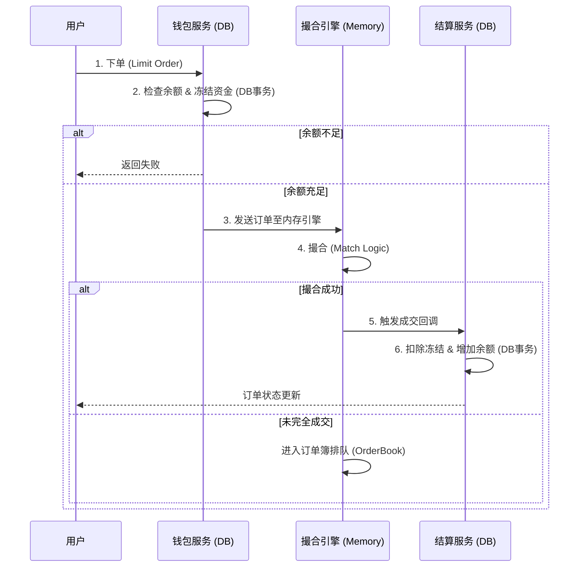

# 🚀 Simple Exchange (MVP)

一个基于 **Spring Boot** 实现的高性能简易数字货币交易所核心（MVP版本）。
本项目演示了交易所最核心的 **"订单-撮合-结算"** 闭环流程，采用 **MySQL 持久化资产** + **Java 内存优先队列撮合** 的混合架构。

## 🌟 特性 (Features)

* **⚡️ 内存撮合引擎**: 基于 `PriorityQueue` 实现的订单簿（OrderBook），支持价格优先、时间优先的撮合逻辑。
* **💰 完整的资金流转**: 实现了下单冻结、撮合成功后的资金解冻与划转。
* **🛡 事务安全**: 关键资金操作均受数据库事务（Transactional）保护。
* **🔌 RESTful API**: 简洁的 HTTP 接口用于挂单测试。
* **🧱 模块化设计**: 引擎层（Engine）与业务层（Service）解耦，便于未来升级为分布式架构。

## 🛠 技术栈 (Tech Stack)

* **核心框架**: Spring Boot
* **ORM 框架**: MyBatis Plus
* **数据库**: MySQL 8.0
* **工具库**: Lombok, JUnit 5
* **构建工具**: Maven

## 🏗 系统架构 (Architecture)

本系统遵循 **"先冻结，后撮合，异步(或回调)结算"** 的原则：



## 🚀 快速开始 (Quick Start)

### 1. 环境准备

* JDK 1.8 或更高版本
* MySQL 5.7 或 8.0
* Maven 3.6+

### 2. 数据库初始化

请在 MySQL 中创建一个名为 `simple_exchange` 的数据库，并执行项目中的 SQL 脚本（通常位于 `sql/schema.sql` 或参考之前的对话记录）。

```sql
CREATE DATABASE simple_exchange;
-- 确保导入 wallet, order_ent, trade_record 表及测试数据

```

### 3. 配置数据库连接

修改 `src/main/resources/application.yml`:

```yaml
spring:
  datasource:
    url: jdbc:mysql://localhost:3306/simple_exchange?useSSL=false&serverTimezone=UTC
    username: your_username  # 替换为你的账号
    password: your_password  # 替换为你的密码

```

### 4. 运行项目

```bash
mvn clean install
mvn spring-boot:run

```

## 🧪 测试指南 (API Usage)

项目启动后（默认端口 8080），你可以使用 cURL 或 Postman 进行测试。

**预设数据**:

* **User 1**: 持有 100,000 USDT (买家)
* **User 2**: 持有 10 BTC (卖家)

### 场景演示：撮合一笔交易

**第一步：卖家挂单 (User 2 卖出 1 BTC @ 50000)**

```bash
curl -X POST "http://localhost:8080/api/order" \
     -d "userId=2" \
     -d "symbol=BTC/USDT" \
     -d "direction=SELL" \
     -d "price=50000" \
     -d "amount=1"

```

**第二步：买家吃单 (User 1 买入 1 BTC @ 50000)**

```bash
curl -X POST "http://localhost:8080/api/order" \
     -d "userId=1" \
     -d "symbol=BTC/USDT" \
     -d "direction=BUY" \
     -d "price=50000" \
     -d "amount=1"

```

**查看结果**:
查看控制台日志或数据库，你会发现 User 1 获得了 1 BTC，User 2 获得了 50000 USDT。

## 📂 项目结构

```text
com.exchange.simple
├── controller      // Web 接口层 (ExchangeController)
├── entity          // 数据库实体 (Wallet, OrderEnt)
├── mapper          // DAO 层 (MyBatis Plus)
├── service         // 业务逻辑层 (TradeService - 负责资金和流程)
└── engine          // 核心引擎层 (OrderBook - 纯内存撮合算法)

```

## 🗺 路线图 (Roadmap)

当前版本为 MVP 教学版，生产环境还需要补充：

* [ ] **Redis**: 缓存 OrderBook 深度图和最新价格。
* [ ] **WebSocket**: (Netty) 实时推送成交信息给前端。
* [ ] **消息队列**: (RabbitMQ/RocketMQ) 将撮合与结算异步化，提高吞吐量。
* [ ] **安全**: 引入 JWT 鉴权。
* [ ] **K线生成**: 定时任务生成 OHLC 数据存入 MongoDB。

## 🤝 贡献

欢迎提交 Issue 或 Pull Request！

## 📄 协议

MIT License