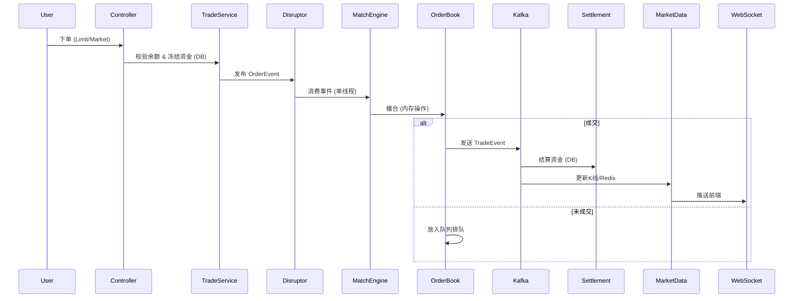
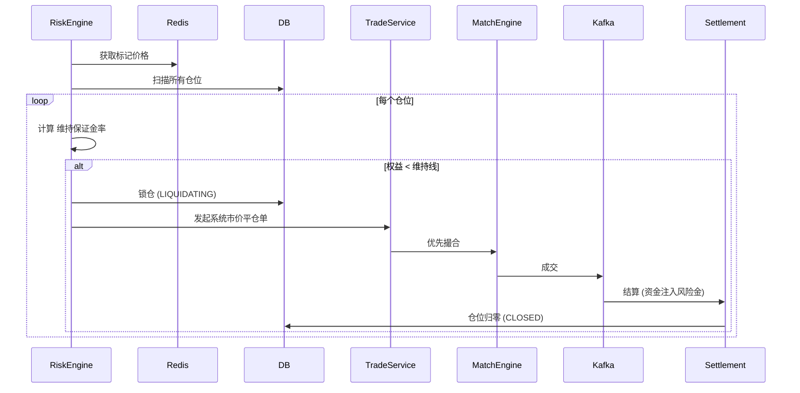

这是一个为您精心整理的 **Simple Exchange 项目开发手册**。

这份手册汇总了我们从零构建这个交易所的所有核心架构决策、数据库设计、关键流程和代码实现逻辑。它非常适合作为你学习 **高并发、金融系统、微服务架构** 的参考资料。

---

# 📘 Simple Exchange 开发手册 (v2.0)

**项目简介**: 一个基于 Java Spring Boot 的高性能数字货币交易所 MVP（最小可行性产品）。
**核心目标**: 演示资金安全、内存撮合、异步结算、实时行情、合约交易及风控系统的实现原理。

---

## 1. 🏗 技术架构 (Architecture)

本项目采用 **“内存优先、异步结算、冷热分离”** 的混合架构。

### 1.1 技术栈 (Tech Stack)

* **开发语言**: Java 17+
* **核心框架**: Spring Boot 2.7
* **持久层**: MyBatis Plus (MySQL)
* **高性能队列**: **LMAX Disruptor** (内存环形队列，无锁)
* **消息中间件**: Apache Kafka (解耦撮合与结算)
* **缓存/实时**: Redis (盘口、K线、最新成交)
* **海量存储**: MongoDB (历史 K 线归档)
* **通讯协议**: REST API (下单), WebSocket (推送)
* **工具**: Lombok, FastJson, JWT, Docker

### 1.2 核心数据流

1. **用户** -> **REST API** (鉴权、冻结资金、落库PENDING)
2. **API** -> **Disruptor** (发布订单事件)
3. **Disruptor** -> **MatchEngine** (单线程内存撮合)
4. **MatchEngine** -> **Kafka** (发送成交消息)
5. **Kafka Consumer** ->
* **Settlement**: MySQL 资金结算、扣费。
* **MarketData**: 计算 K 线、更新盘口 -> Redis -> WebSocket。
* **Contract**: 更新仓位、计算盈亏。


---

## 2. 💾 数据库设计 (Database Schema)

### 2.1 MySQL (资产与订单)

核心原则：**资金流水的 ACID 事务性**。

| 表名 | 描述 | 关键字段 |
| --- | --- | --- |
| `user` | 用户表 | `id`, `username`, `password` (Hash) |
| `wallet` | **现货钱包** | `user_id`, `coin`, `balance`, `frozen` |
| `contract_wallet` | **合约钱包** | `user_id`, `coin`, `balance`, `frozen` |
| `transaction` | **资金流水** | `tx_hash` (幂等键), `type` (DEPOSIT/WITHDRAW), `status` |
| `order_ent` | **现货订单** | `status` (PENDING/COMPLETED), `type` (LIMIT/MARKET) |
| `contract_order` | **合约订单** | `leverage`, `direction` |
| `contract_position` | **合约仓位** | `entry_price`, `size`, `margin`, `leverage` |

### 2.2 Redis (实时热数据)

* `kline:{symbol}:{period}:{timestamp}`: 实时 K 线数据 (JSON)
* `trades:{symbol}`: 最新成交列表 (List, Limit 20)
* `depth:{symbol}`: 盘口快照 (Hash/ZSet)

### 2.3 MongoDB (历史数据)

* Collection: `kline_1m`, `kline_1h`, `kline_1d`
* 策略：定时任务每分钟将 Redis 的过期 K 线归档至 Mongo。

---

## 3. 🧩 核心模块详解

### 3.1 ⚡️ 撮合引擎 (Match Engine)

**位置**: `com.exchange.simple.engine`
**核心技术**: `PriorityQueue` (JDK) + `Disruptor` (LMAX)

* **数据结构**:
* `buyQueue`: 价格从高到低排序 (Max Heap)。
* `sellQueue`: 价格从低到高排序 (Min Heap)。


* **并发模型**: 全局单线程消费者 (`MatchEventHandler`)，避免了 `synchronized` 锁竞争，吞吐量可达百万级 DPS。
* **重启恢复 (Crash Recovery)**:
* 利用 `@PostConstruct`。
* 系统启动时，从 MySQL 读取所有 `PENDING` 订单，重新 `add` 到内存队列。


### 3.2 💰 现货结算 (Spot Settlement)

**位置**: `com.exchange.simple.service.TradeService.executeSettlement`

* **逻辑**: 收到 Kafka 成交消息后执行。
* **公式**:
* **买家**: 获得 BTC (扣除手续费)，扣除冻结的 USDT。
* **卖家**: 获得 USDT (扣除手续费)，扣除冻结的 BTC。


* **费率**: 0.1% (`FEE_RATE`)，收入转入平台账号 `id=1`。

### 3.3 📈 合约交易 (Perpetual Futures)

**位置**: `com.exchange.simple.service.ContractService`

* **模型**: 逐仓模式 (Isolated Margin)。
* **开仓**: `balance` -> `frozen` (保证金)。
* **仓位更新**:
* **加仓**: `entry_price` = (旧价值+新价值)/总数量。
* **平仓**: 释放保证金 + `(卖出价-买入价)*数量` 的盈亏。


* **☠️ 风控引擎 (Risk Engine)**:
* 独立线程 `@Scheduled(fixedRate = 500)`。
* 逻辑: 当 `(保证金 + 未实现盈亏) < (持仓价值 * 0.5%)` 时，触发 **强平 (Liquidation)**。
* 操作: 系统接管仓位 -> 市价平仓 -> 剩余资金注入风险金。


### 3.4 📊 行情系统 (Market Data)

**位置**: `com.exchange.simple.consumer.MarketDataConsumer`

* **K线生成**: 时间戳对齐算法 (`timestamp / 60000 * 60000`)。
* **推送**: Spring WebSocket (`SimpMessagingTemplate`)。
* **频道**:
* `/topic/kline/BTC/USDT/1m` (K线)
* `/topic/trades/BTC/USDT` (最新成交)
* `/topic/depth/BTC/USDT` (盘口深度)


### 3.5 🛡 安全与鉴权 (Security)

**位置**: `com.exchange.simple.config.LoginInterceptor`

* **JWT**: 生成无状态 Token，包含 `userId`。
* **ThreadLocal**: `UserContext` 存储当前线程用户 ID，Controller 层无感知。
* **接口保护**: 除登录注册外，所有 `/api/**` 均需 `Authorization: Bearer <token>`。

---

## 4. 📝 关键业务流程图

### 4.1 现货下单流程



### 4.2 合约爆仓流程



---

## 5. 🤖 机器人模块 (Robot)

**作用**: 提供流动性，防止冷启动时的尴尬。
**策略**:

1. 爬取 Binance 价格。
2. 在当前价格上下随机挂单 (Buy Limit & Sell Limit)。
3. 自我对敲 (Self-Trade) 制造 K 线 (可选)。

---

## 6. 🚀 部署与运行

### 环境准备

```bash
# 启动基础组件
docker run -d -p 3306:3306 mysql:8.0
docker run -d -p 6379:6379 redis:alpine
docker run -d -p 27017:27017 mongo
# Kafka 需要 Zookeeper，建议使用 docker-compose

```

### 启动顺序

1. 初始化 MySQL 表结构 (`schema.sql`)。
2. 修改 `application.yml` 配置数据库连接。
3. 启动 Spring Boot 应用。
4. (可选) 启动机器人模块。

### 常见问题

* **重启后数据丢失？** -> 检查 `TradeService.init()` 是否正确读取了 `PENDING` 订单。
* **K线不跳动？** -> 检查 Kafka 是否连接成功，或 WebSocket 是否订阅正确频道。
* **提现没反应？** -> 检查 `transaction` 表状态是否为 `PENDING`，需要调用 `/audit` 接口审核。

---

## 7. 🔮 进阶优化路线 (Roadmap)

如果想将此项目用于生产，还需补充：

1. **分布式架构**: 将 Engine, Wallet, Market 拆分为独立的微服务 (Spring Cloud)。
2. **定序网关**: 确保所有订单在进入 Disruptor 前有全局唯一的 Sequence ID。
3. **冷钱包集成**: 真实的 BTC/ETH 节点对接，私钥离线存储。
4. **撮合快照**: 定时将内存 OrderBook 序列化到磁盘，加快重启恢复速度。

---

*End of Manual*